# We Share It - Social Media Platform

Welcome to We Share It - a dynamic social media platform designed for individuals who love sharing their experiences, interests, and inspirations through captivating photos and videos. This platform provides a visually immersive way to connect, explore, and engage with a diverse community of content creators.

The purpose of this Portfolio Project #5(Advanced Front-End Project), this is part of me achieving the Diploma in Full Stack Software Development at [Code Institute](https://codeinstitute.net/).


[View live website here](https://weshare-it-2feb6d10cc1b.herokuapp.com/login)

## Table of content
1. [Project](#project)
   - 1.1 [Objective](#objective)
   - 1.2 [Site Users Goal](#site-user-goal)
   - 1.3 [Site Owners Goal](#site-owners-goal)
   - 1.4 [Project Management](#project-management)
2. [User Experience](#user-experience)
   - 2.1 [Wireframes](#wireframes)
   - 2.2 [User Stories](#user-stories)
   - 2.3 [Site Stracture](#site-structure)
   - 2.4 [Design](#design)
      - 2.4.1 [Typography](#typography)
      - 2.4.2 [Color scheme](#color-scheme)
3. [Features](#features)
   - 3.1 [Navigation](#navigation)
   - 3.2 [Authentication](#authentication)
   - 3.3 [Home page](#home-page)
   - 3.4 [Feed](#feed)
   - 3.5 [Loved](#loved)
   - 3.6 [Profile page](#profile-page)
   
   [Future features](#future-features)
 4. [Technologies Used](#technologies-used)
    - 4.1 [Languages](#languages)
    - 4.2 [Frameworks, Toolkit & Software](#frameworks-toolkit-software)
    - 4.3 [Libraries](#libraries)
5. [Testing](#testing)
   - 5.1 [Code Validation](#51-code-validation)
   - 5.2 [Fixed bugs](#52-fixed-bugs)
   - 5.3 [Supported screens and browsers](#53-supported-screens-and-browsers)
   - 5.4 [Test cases](#54-test-cases)
   - 5.5 [Automation test](#55-automation-test)
6. [Deployment](#deployment)
7. [Credits](#credits)

## Project

### Objective
<hr>
The primary objective of "WeShareIt," our social media platform, is to connect people with similar interests, facilitate content sharing, foster online communities, support private and group communication, encourage user engagement, ensure a seamless user experience, and expand its global presence by accommodating diverse languages and cultures.

### Site Users Goal
<hr>
The site users' goal on "WeShareIt" is to connect, share, and engage within a diverse online community.

### Site Owners Goal
<hr>
The site owner's goal for "WeShareIt" is to provide a vibrant and user-friendly social media platform that fosters meaningful connections, content sharing, and community engagement while ensuring the platform's sustainability and growth.

### Project Management
<hr>

#### Gihub Project Board


#### Database Schema

 All the models have been set up in a separate DRF repository. Click [here](https://github.com/araldwin/weshareit-api) to view the repository or [here](https://wsiapi2023-b84941ad1c92.herokuapp.com/) to view the deployed API.

[Back to top](#table-of-content)

## User Experience
<hr>

### Wireframes
<hr>

 I used balsamiq to create wireframes for my project.
- [View wireframes here]()

### User Stories
<hr>

### _As a Site User, I Want To:_

1. **Sign Up and Log In**
   - Sign up for a new account.
   - Log in securely to access my account and personalized content.

2. **Create and Edit My Profile**
   - Create and customize my user profile with a profile picture and personal information.
   - Edit my profile details, including my name, bio, and profile picture.

3. **Discover Content**
   - Explore  photos shared by other users.
   - Discover trending and popular posts from different categories.

4. **Follow and Interact With Users**
   - Follow other users whose content I find interesting.
   - Like, comment on, and share posts from users I follow.

5. **Create and Share Posts**
   - Create or upload images to engage with the community.
   - Add hashtags and categories to make my posts discoverable by others.

6. **Search and Discover Users, Content, and Communities**
   - Search for specific users using keywords and filters.
   - Discover new users, most like post , and vibrant communities of interest.

7. **Log Out and Secure My Account**
    - Log out of my account to protect my privacy and security.
    - Reset my password in case of login issues.

8. **Access Across Devices**
    - Seamlessly access the platform on various devices, including desktop, mobile, and tablets.

[Back to top](#table-of-content)

### Site Structure
<hr>
   
The site structure for WeShare-It, the social media platform, encompasses various key sections, including a dynamic home page for user engagement, user profiles for personalization, content feeds for sharing and discovery, post creation capabilities, and a custom 404 error page, all designed to create an intuitive and engaging user experience.

[Back to top](#table-of-content)

### Design
<hr>

 WeShare-It boasts an elegantly crafted and user-centric design, seamlessly blending visually appealing aesthetics with intuitive navigation, ensuring an engaging and delightful social media experience for all users.

- ### Typography
   <hr>
   <details><summary>typography screen shot</summary>
      <p> 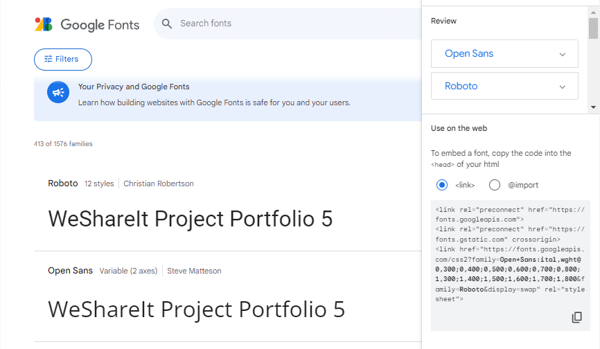</p>
      </details>
      In this project, I use font-family Roboto and Open Sans.
- ### Color scheme
   <hr>
   <details><summary>color palette preview</summary>
      <p> </p>
      </details>
      These colors are integral to the overall design and appearance of the website.

[Back to top](#table-of-content)
## Features
- ### A Simple, Easy to Remember URL:[WeShare-It](https://weshare-it-2feb6d10cc1b.herokuapp.com/)
   <hr>

- ### Navigation
   <hr>
   
    The navigation bar adapts its functionalities based on the user's authentication status, providing different options for logged-out and logged-in users. It also ensures responsiveness for mobile and tablet devices.
   #### _Logged-Out State_
   - ##### Logo and Navigation:
      - WeShare-it logo on the left
      - Home icon
      - Login/Authenticate page on the right
         <details><summary>Logged-Out State Preview</summary>
         <p>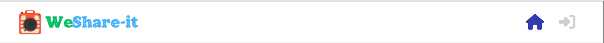</p>
         </detail>
      - Mobile Responsiveness View
         - Hamburger icon to reveal dropdown menu for navigation options
            <details><summary>Mobile Preview</summary>
            <p>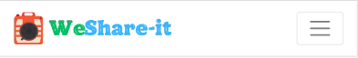</p>
            </detail>
   #### _Logged-In State_
   - ##### Logo and Navigation:
      - WeShare-it logo on the left
      - Create Pin icon
      - Functionalities: Home, Feed, Loved, Logout, Profile icons on the right
         <details><summary>Logged-In State Preview</summary>
         <p>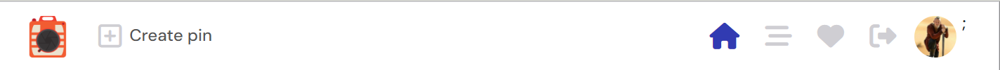</p>
         </detail>
      - Mobile Responsiveness View
         - Hamburger icon to reveal dropdown menu for navigation options
            <details><summary>Mobile Preview</summary>
            <p>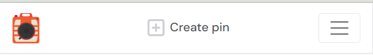</p>
            </detail>
- ### Authentication
   <hr>

    Users can log-in, and log-out using the options provided in the navigation bar.
   #### _Sign up process_
   - New users who wish to create an account on WeShare-it can follow these steps:
      1. Click on the **Sign-up** menu option in the Log-in Page.
      2. Follow the user account sign-up process provided through dj-rest/auth/registration.
      3. Enter necessary details to create a new user account.
               <details><summary>Sign-up Preview</summary>
               <p>_Desktop/Laptop Sign-up Preview_<br>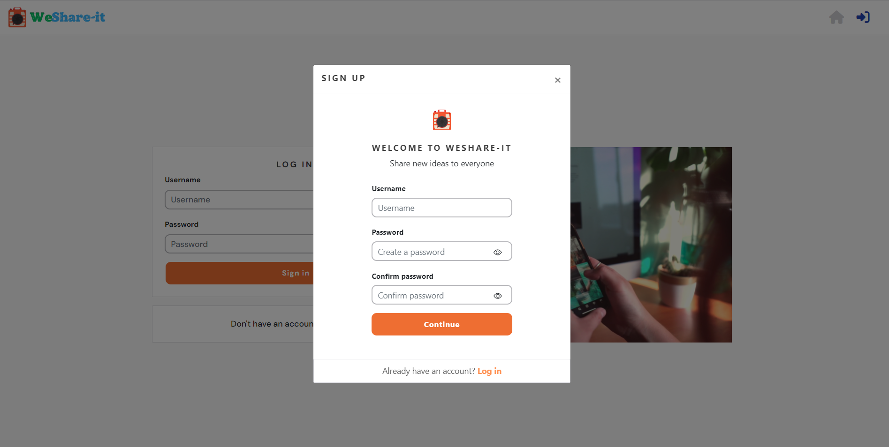</p>
               <p>_Mobile Sign-up Preview_<br>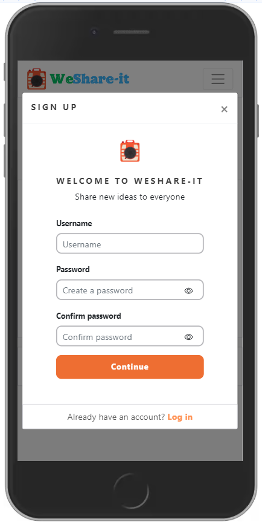</p>
               <p>_Tablet Sign-up Preview_<br>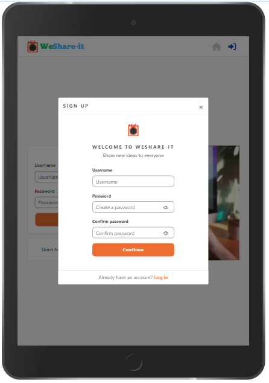</p>
               </detail>
   #### _Log In process_
   - Existing users with a WeShare-it user account can sign in by:
      1. Clicking on the **Log-in icon** menu option in the Navigation Bar.
      2. Providing their credentials (username and password) through the authentication process.
               <details><summary>Log in Preview</summary>
               <p>_Desktop/Laptop view_<br>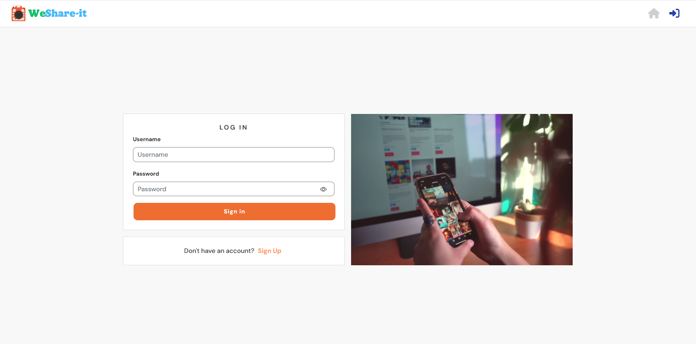</p>
               <p>_Mobile Sign-up Preview_<br>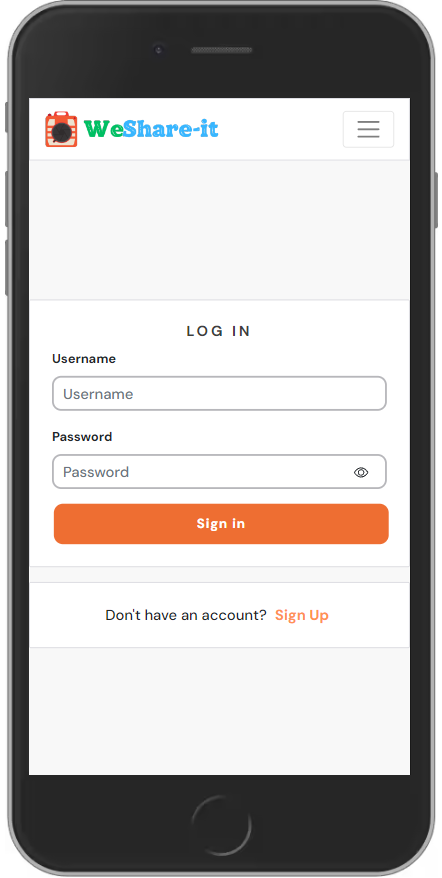</p>
               <p>_Tablet Sign-up Preview_<br>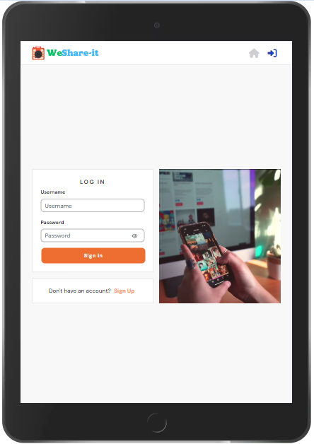</p>
               </detail>
   #### _Log out process_
   - Once logged in, users can log-out by:
      1. Clicking on the **Log-out icon** visible in the Navigation Bar.        
               <details><summary>Log-out icon Preview</summary>
               <p>_NavBar view_<br>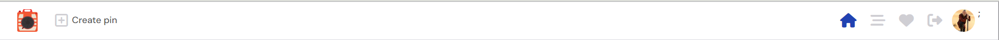</p>
               <p>_Log-out icon_<br>
               </p>
               <summary>**Mobile Log-out Preview**</summary>
               <p>- _Select burger icon to see the log-out icon._ <br>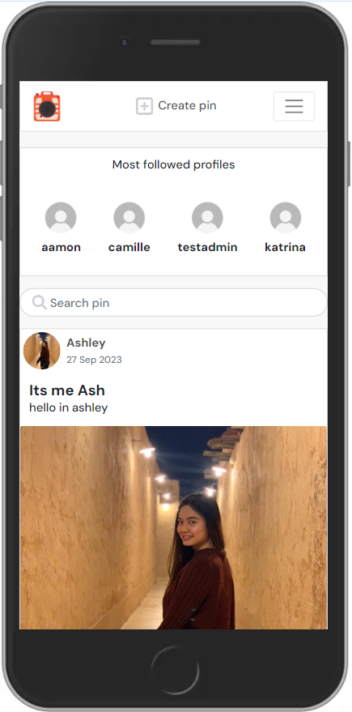</p>
               </detail>

 - ### Home page
   <hr>

   The three main components of the WeShare-It home page, highlighting the functionality and layout of each section. 
   
   1. **Most Followed Profiles**

      The Most Followed Profiles component showcases the top four users with the highest follower count. The layout and interaction differ based on device views (desktop/laptop vs. tablet/mobile).

      - Displays avatars and usernames of the most followed profiles for logged-out users in desktop/laptop view.
            <details><summary>Preview</summary>
            <p>_Desktop/Laptop view_<br>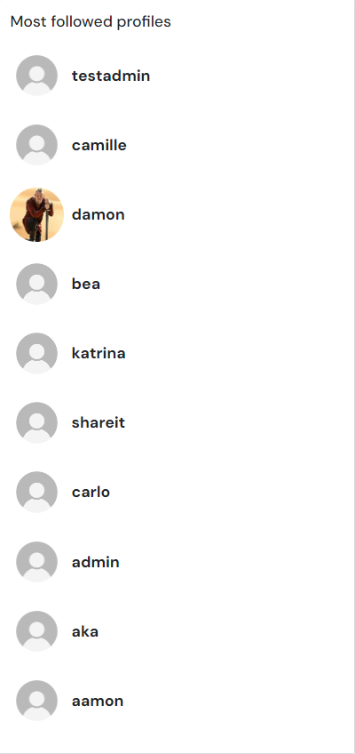</p>
            </detail>

      - Shows the top four most followed profiles for logged-out users in tablet/mobile view.
            <details><summary>Preview</summary>
            <p>_Mobile view_<br>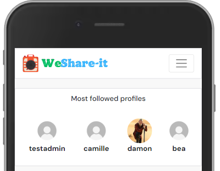</p>
            <p>_Tablet view_<br>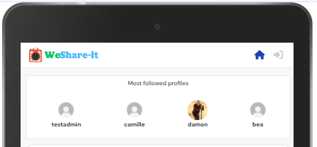</p>
            </detail>

      - Logged-in users (desktop/laptop view) can follow/unfollow profiles directly from this component.
            <details><summary>Preview</summary>
            <p>_Desktop/Laptop view_<br>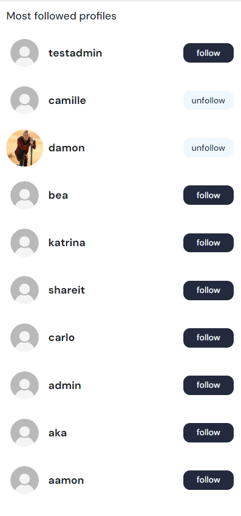</p>
            </detail>
      
      - Clicking on an avatar redirects to the full profile page of the respective user.

   2. **Created pins**

      The Created pins component displays all pins created through the WeShare-It platform. Pins are ordered by the created date, with the most recent ones appearing first.
      
      - Masonry layout on desktop/laptop/tablet view for optimal pin display.
            <details><summary>Preview</summary>
            <p>_Desktop/Laptop view_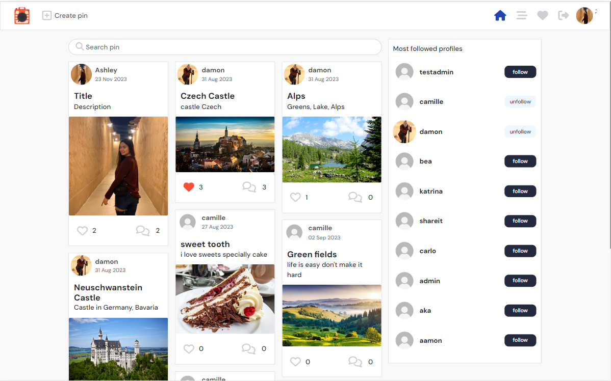</p>
            <p>_Tablet view_ <br>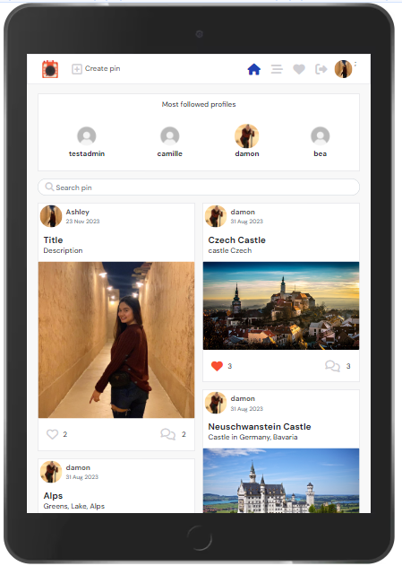</p>
            </detail>

      - Infinite scroll method for mobile view to handle the pins' presentation.
            <details><summary>Preview</summary>
            <p>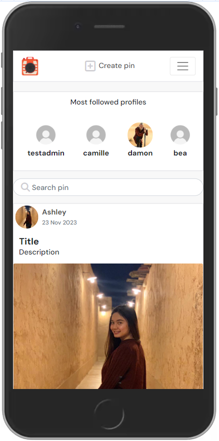</p>
            </detail>

      - Information displayed: user who posted the pin, date, title, description, pin image, love (like) counts, comment counts.

      - User-specific interactions: Love/unlove functionality for logged-in users (excluding their own pins), comment functionality.

   3. **Search and Filter**

      The Search and Filter component allows users to search for specific pins by Title, user name, description, or categories.

      - Enables users to search for pins based on various criteria.
      - provides a filtering mechanism for a refined search experience.
            <details><summary>Search and Filter Preview</summary>
            <p>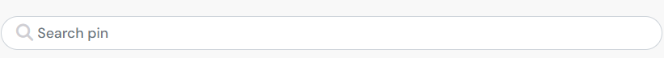</p>
            </details>
      
- ### Feed
  <hr>

   The Pins Display in the Feed page showcases all pins posted by users that the currently logged-in user is following or has followed. It filters and displays only the pins created by users that the logged-in user is following.

   - Fetches pins from the API but filters to show only those posted by users followed by the logged-in user.
   - If the logged-in user is not following any users or is new, a "No results found" message is displayed inside the Feed component.
   - Similar layout and functionality as the homepage's Pins component, displaying followed users' pins.
   - Access to the Feed is restricted when the user is logged out.
            <details><summary>Feed Page Pins Display</summary>
            <p>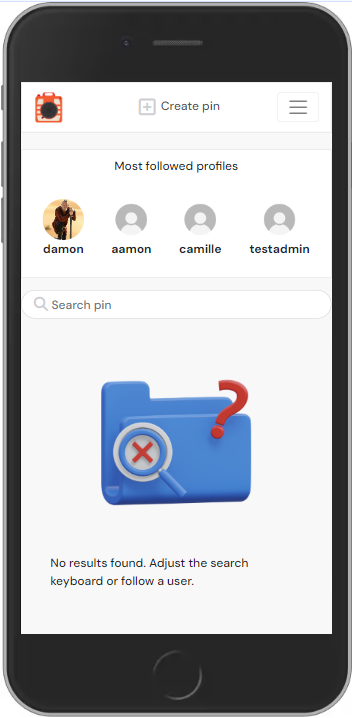</p>
            </details>
            
- ### Love
  <hr>

   The Pins Display in the Love page showcases all the pins that the currently logged-in user has loved across the platform. It exclusively displays the pins that the logged-in user has interacted with positively.

   - Fetches pins from the API that the logged-in user has loved.
   - Only displays pins that have been loved by the logged-in user.
   - Access to the Love page is restricted when the user is logged out.

           
- ### Create pin
  <hr>

   The Create Pin page allows logged-in users to share new pins with the community. It comprises essential fields required for pin submission, including Upload Photo, Title, Pin Description, Destination Link, and Choose Pin Category.

   - Mandatory Fields: Upload Photo and Title are mandatory fields for successful pin submission.
   - Optional Fields: Pin Description, Destination Link, and Pin Category are optional but enhance the pin's details.
   - Successful submission redirects the user to the newly created pin's details page.
   - Each pin shared incrementally increases the user's pin count displayed on their profile page.
            <details><summary>Create Pin page preview</summary>
            <p>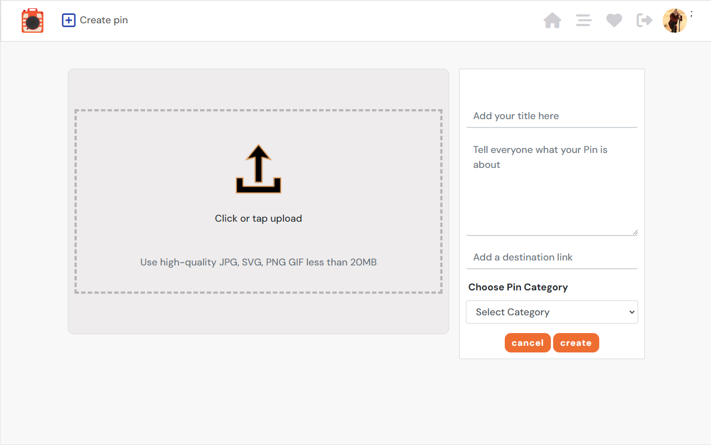</p>
            </details>
- ### Pin Detail Page
  <hr>

   The Pin Detail page showcases comprehensive information regarding a single pin. Users can access this page by clicking on a pin image from the homepage or a user's profile page.

   - Displays detailed information related to a single pin, including the uploaded photo, title, description, destination link, and pin category.
   - Owner-specific actions: If the user is the owner of the pin, they can access edit and delete options represented by three dots in the top right corner of the page.
   - Edit functionality allows the owner to update pin details, redirecting them to a pre-populated Create Pin form.
            <details><summary>Edit Pin preview</summary>
            <p>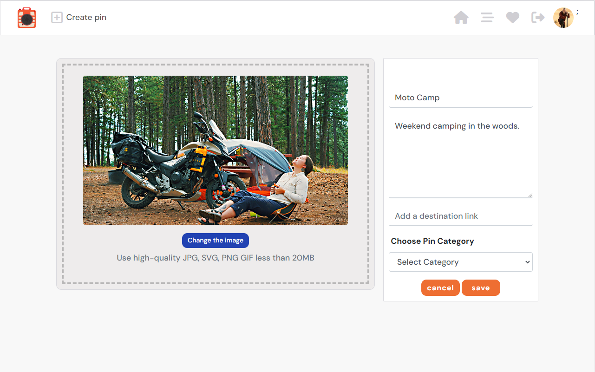</p>
            </details>
   
   **Comments and Love/Like Section**
      
   **Comments**
   
   Below the pin details, users can view and post comments about the pin. If no comments exist, a message prompts users to be the first to comment. Logged-Out Users can read existing comments but cannot post comments without logging in. Owners of comments can edit and delete their own comments by selecting three dots to the right side of the comment section.

   **Love**
   
   Allows users to love a pin. Increases the pin's love count. Logged_In Users can love a pin but cannot like their own pins. Each comment or love action increments the respective counts for the pin. Loved pins are reflected in the user's Love component/page in the navbar.
            <details><summary>Pin Detail page preview</summary>
            <p>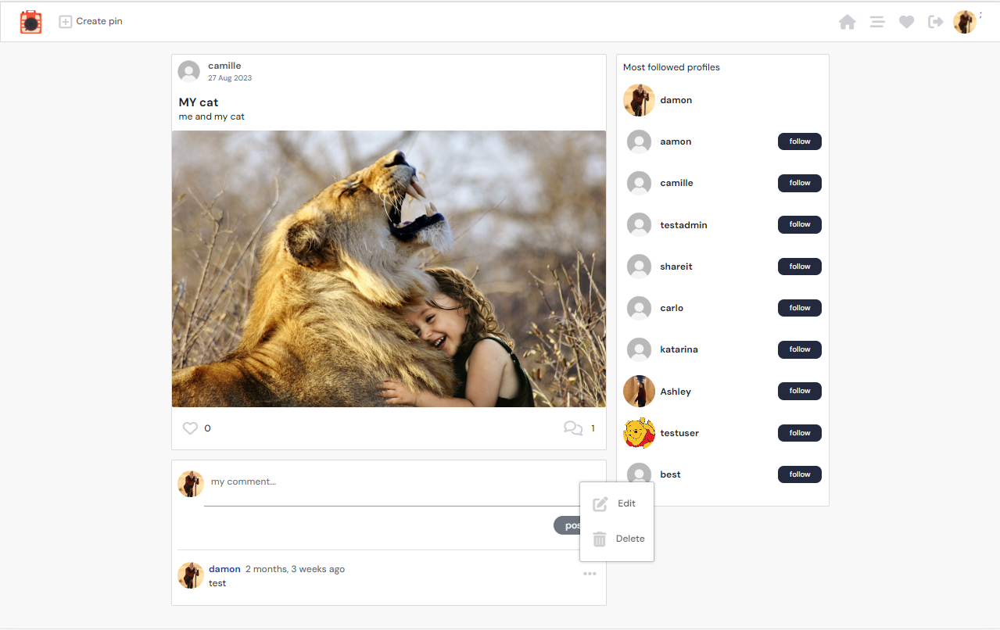</p>
            </details>

- ### Profile Page
  <hr>

  Profile avatars across the site (most followed profiles, posted pins, comments) serve as links to view the full profile page of that user. Additionally, users can access their own profile page through the Navigation Bar.

  - Clicking on a profile avatar leads to the user's full profile page.
  - Navigation Bar includes a direct link to the user's own profile page.
            <details><summary>Profile page preview</summary>
            <p>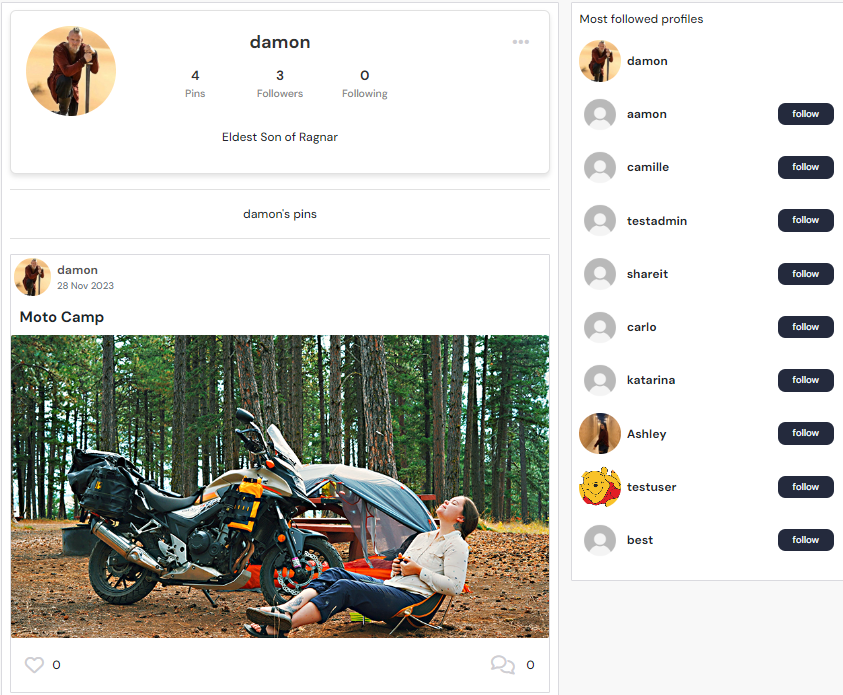</p>
            </details>
            

   **Profile Stats**

   - **User Information**
      - Auto-Creation: Upon signup, a basic profile is auto-generated with a username, password, and default avatar image.
      - Updated Information: Profile usage stats include the number of pins posted, profiles followed, and followers.
      - About Container: Initially empty, users can edit their profile to add personal Bio.
   
   - **Editing Profile**
      - Editing Bio: Users can click on the three dots dropdown in their own profile to access the Edit Profile option.
      - Edit Profile Page: Redirects users to a form to add or change their avatar image and Bio.
      - Visibility: Profile details filled in here become visible to other users in the main profile stats container.
            <details><summary>Profile page edit preview</summary>
            <p>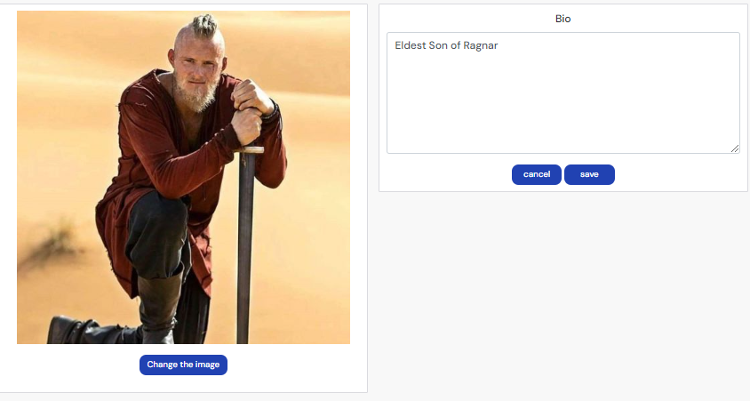</p>
            </details>

   
   - **Follow Functionality**
      - Follow/Unfollow: Each profile has a follow button within the stats container for other users to follow/unfollow.
      - Purpose: Not all profiles appear in the most followed component, enabling access to follow functionality.
            <details><summary>Other User's Profile preview</summary>
            <p>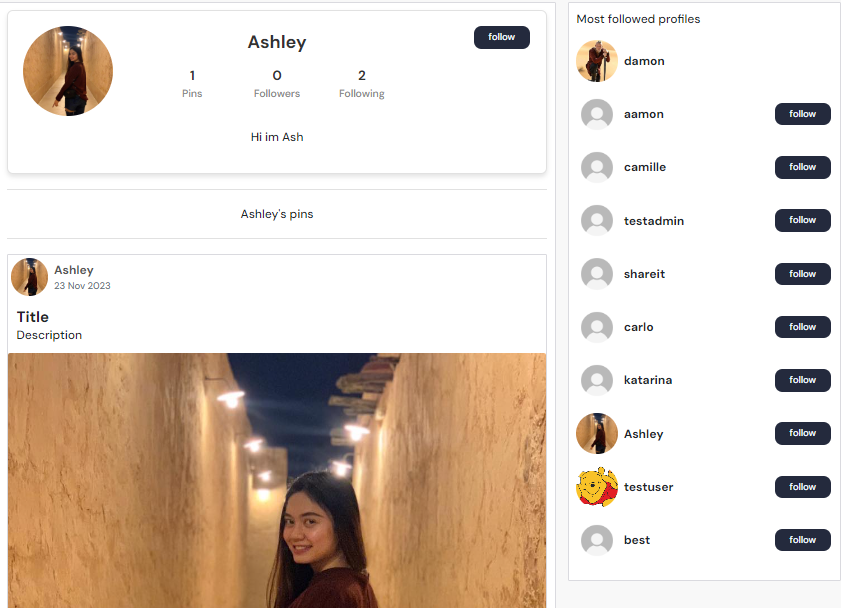</p>
            </details>

   **Posted Pins Section**

   **Display of Pins**
   
   Below the profile stats, all the pins posted by the viewed profile are displayed. Each pin is clickable to view its individual detail page, including comments (if any).

   [Back to top](#table-of-content)
- ### Future features
  <hr>

   #### **Enhanced User Experience**

   #### Pinterest-Style Interface

   - **Photo-Centric Homepage**: Display pins as images primarily in the homepage layout, mirroring the Pinterest style.

   #### Navigation Enhancements

   - **Dropdown Menu**: Create a dropdown menu within the navbar to encapsulate all site components for easier navigation and a cleaner UI.

   #### Functional Improvements

   - **Delete Confirmation Component**: Implement a confirmation component when deleting items to prevent accidental deletions.
   - **Category Section in Homepage**: Introduce a category section in the homepage to facilitate organized pin browsing.

   #### Profile Page Enhancements

   - **Expanded Profile Editing**: Include additional details such as First Name, Last Name, Website, and Username in the profile editing section for a more comprehensive user profile.
   - **Download and Save Pins**: Enable users to download and save their posted pins for personal use.
   - **Private Messaging**: Incorporate a messaging system to facilitate communication between users.

   ### Independent Development Support

   - **Self-Reliance**: Enable users to address development hurdles by incorporating more detailed guidance within the app itself, reducing reliance on external support systems.
   - **Documentation Enhancement**: Improve documentation within the app to provide comprehensive guidance on various functionalities and troubleshooting steps.

   ### Personal Development Efforts

   - **Self-Training**: Incorporate walkthroughs, tutorials, or guides within the app to assist in self-training and development efforts.
   - **Resource Integration**: Integrate resources within the app interface to assist in resolving coding issues or seeking guidance, reducing reliance on external sources.
   
[Back to top](#table-of-content)

## Technologies Used
 ### Languages
 - [React.js](https://react.dev/)
 - [JavaScript](https://www.javascript.com/)
 - [HTML5](https://html.spec.whatwg.org/)
 - [CSS3](https://www.w3.org/TR/CSS/#css)


### Frameworks Toolkit Software
   - [Am I Responsive](https://ui.dev/amiresponsive) - online tool used to create mockup to present responsive design of this project.
   - [Balsamiq](https://balsamiq.com) - design tool used for creating wireframes.
   - [Canva](https://canva.com) - used to create the WeShare-It logo.
   - [Chrome DevTools]() - used to inspect the rendered HTML (DOM) and network activity of my pages. Used to troubleshoot ad serving issues.
   - [Cloudinary](https://cloudinary.com) - a service that hosts image files in the project.
   - [Coolors.co](https://coolors.co) - used to create color palette.
   - [CSS Valitadtion](https://jigsaw.w3.org/css-validator/) - used to validate CSS code.
   - [Fontawesome](https://fontawesome.com/icons/) - where i import font icons for this project.
   - [Favicon.io](https://favicon.io/favicon-generator/) - generator i use to create favicon for this project.
   - [Google Fonts](https://fonts.google.com) - where i import and use font-style for this project.
   - [Git](http://gitscm.com) - Git was used for version control by utilizing the Gitpod terminal to commit to Git and Push to GitHub.
   - [Gitpod](https://gitpod.io) - IDE used to code the project.
   - [GitHub](https://github.com) - GitHub is used to store the project's code after being pushed from Git.
   - [Heroku](https://heroku.com) - a container-based cloud Platform used to deploy, manage, and scale apps.
   - [HTML Validation](https://validator.w3.org/) -used to validate HTML code.
   - [JSHint Validation](https://jshint.com/)  - used to validate JavaScript code.
   - [Lighthouse]() - used to test site performance
   - [React Bootstrap](https://react-bootstrap.github.io/) - use to build front-end framework.
   - [Visual Studio Code for Windows](https://code.visualstudio.com/) - IDE used to code the project.
   - [Windows Snipping Tool]() - used to save the screen shot.

   [Back to top](#table-of-content)

### Libraries
   - [react-router-dom@5.3.0](https://reactrouter.com/en/6.20.0/start/overview)

   [Back to top](#table-of-content)

## Testing

   click [here](TESTING.md) for more information about testing WeShare-It Frontend.

   [Back to top](#table-of-content)
## Deployment
### Deployment to Heroku

### Prerequisites

- Gitpod Workspace
- Heroku Account
- GitHub Repository

### Steps

1. **Create Heroku App**
   - Log in to your Heroku account.
   - Select "Create New App" and assign a unique project-related name.
   - Choose a region and create the app.

2. **Connect GitHub Repository**
   - In the Heroku dashboard, navigate to the 'Deploy' tab.
   - Choose GitHub as the deployment method.
   - Find your project repository and connect it.

3. **Deploy Application**
   - Select the branch to deploy.
   - Click 'Deploy branch' to initiate the build process.
   - Once build succeeds, click 'Open App' to view your application.

## Connecting React Frontend to API Backend

### Prerequisites

- Deployed API Backend
- Axios Library (for making HTTP requests)

### Steps

1. **Heroku API Application Settings**
   - Access the Heroku dashboard and locate your API application settings.
   - Add new Config Vars:
     - `CLIENT_ORIGIN`: Set to the deployed React application URL (e.g., https://your-deployed-react-app.herokuapp.com).
     - `CLIENT_ORIGIN_DEV`: Set to the Gitpod preview link URL (without trailing slash).

2. **Frontend Setup**

   - In the Gitpod workspace, install the Axios library:
     ```
     npm install axios
     ```

   - Create an 'API' folder and inside it, create a file named 'axiosDefaults'.
     - Import Axios at the top of the file.
     - Define the baseURL as the unique URL of your deployed API project.
     - Set the content-type header to 'multi-part/form-data'.
     - Set 'withCredentials' to `true` to avoid CORS issues.

3. **Usage in App.js**
   - Import the created 'axiosDefaults' file into App.js to utilize it across all pages.

### Additional Notes

- Regularly check and update the deployed URLs as they might change.
- Ensure configurations and settings align between the frontend and backend for seamless communication.

[Back to top](#table-of-content)

## Credits

   - [Moments](https://learn.codeinstitute.net/courses/course-v1:CodeInstitute+RA101+2021_T3/courseware/70a8c55db0504bbdb5bcc3bfcf580080/953cd4e5015f483bb05263db3e740e19/) - Code Institute walkthrough
   - [Stack Overflow](https://stackoverflow.com/) - used to solve bugs, and learn to understand more about what the code does and how it works properly.
   - [JavaScript Mastery](https://www.youtube.com/watch?v=1RHDhtbqo94&list=PL6QREj8te1P6wX9m5KnicnDVEucbOPsqR&index=17) - Youtube tutorials i used to get ideas for my WeShare-It project.

## Acknowledgements

   - Mr. Rohit to my mentor
   - Student Support team
   - Slack community
   - Code institute

## Disclaimer
   - WeShare-It was created for educational purpose only.
   
[Back to top](#table-of-content)
   

