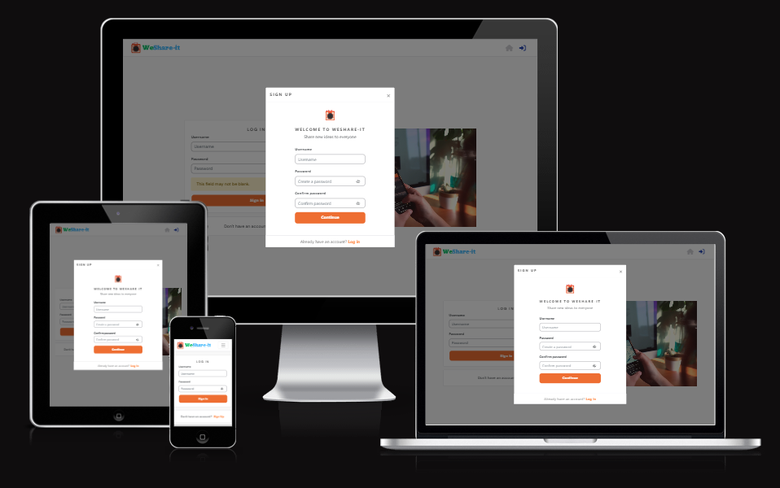
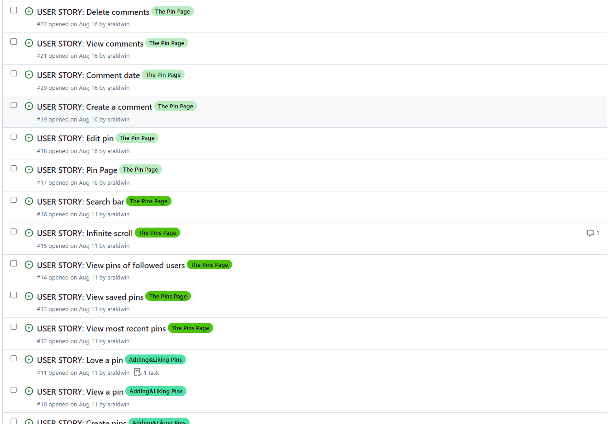
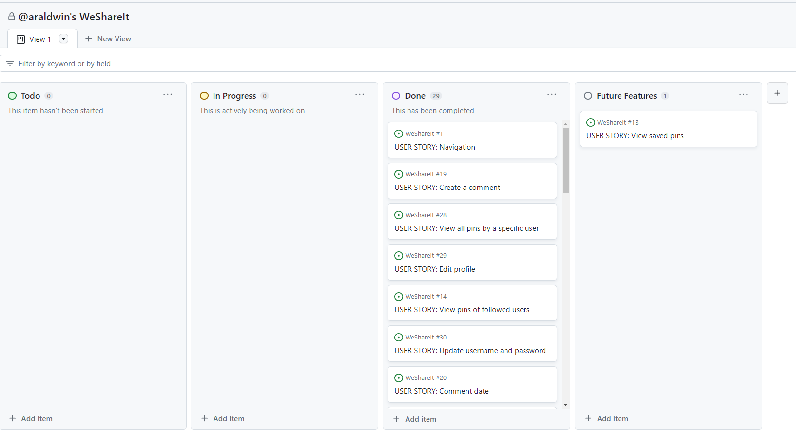

# We Share It - Social Media Platform

Welcome to We Share It - a dynamic social media platform designed for individuals who love sharing their experiences, interests, and inspirations through captivating photos and videos. This platform provides a visually immersive way to connect, explore, and engage with a diverse community of content creators.

The purpose of this Portfolio Project #5(Advanced Front-End Project), this is part of me achieving the Diploma in Full Stack Software Development at [Code Institute](https://codeinstitute.net/).

[View live website here](https://weshare-it-2feb6d10cc1b.herokuapp.com/login)

1. [Project](#project)
   - 1.1 [Objective](#objective)
   - 1.2 [Site Users Goal](#site-user-goal)
   - 1.3 [Site Owners Goal](#site-owners-goal)
   - 1.4 [Project Management](#project-management)
2. [User Experience](#user-experience)
   - 2.1 [Wireframes](#wireframes)
   - 2.2 [User Stories](#user-stories)
   - 2.3 [Site Stracture](#site-structure)
   - 2.4 [Design](#design)
      - 2.4.1 [Typography](#typography)
      - 2.4.2 [Color scheme](#color-scheme)
3. [Features](#features)
   - 3.1 [Navigation](#navigation)
   - 3.2 [Authentication](#authentication)
   - 3.3 [Home page](#home-page)
   - 3.4 [Feed](#feed)
   - 3.5 [Loved](#loved)
   - 3.6 [Profile page](#profile-page)
   [Future features](#Future-features)
 4. [Technologies Used](#technologies-used)
    - 4.1 [Languages](#langauges)
    - 4.2 [Frameworks, Toolkit & Software](#frameworks-toolkit-software)
    - 4.3 [Libraries](#libraries)
5. [Testing](#testing)
   - 5.1 [Code Validation](#51-code-validation)
   - 5.2 [Fixed bugs](#52-fixed-bugs)
   - 5.3 [Supported screens and browsers](#53-supported-screens-and-browsers)
   - 5.4 [Test cases](#54-test-cases)
   - 5.5 [Automation test](#55-automation-test)
6. [Deployment](#deployment)
7. [Credits](#credits)

## Project

### Objective

The primary objective of "WeShareIt," our social media platform, is to connect people with similar interests, facilitate content sharing, foster online communities, support private and group communication, encourage user engagement, ensure a seamless user experience, and expand its global presence by accommodating diverse languages and cultures.

### Site Users Goal

The site users' goal on "WeShareIt" is to connect, share, and engage within a diverse online community.

### Site Owners Goal

The site owner's goal for "WeShareIt" is to provide a vibrant and user-friendly social media platform that fosters meaningful connections, content sharing, and community engagement while ensuring the platform's sustainability and growth.

### Project Management

#### Gihub Project Board

#### Database Schema

All the models have been set up in a separate DRF repository. Click [here](https://github.com/araldwin/weshareit-api) to view the repository or [here](https://wsiapi2023-b84941ad1c92.herokuapp.com/) to view the deployed API.

[Back to top](#table-of-content)

## User Experience

### Wireframes

 - I used balsamiq to create wireframes for my project.
    - [View wireframes here]()

### User Stories

### As a Site User, I Want To:

1. **Sign Up and Log In**
   - Sign up for a new account.
   - Log in securely to access my account and personalized content.

2. **Create and Edit My Profile**
   - Create and customize my user profile with a profile picture and personal information.
   - Edit my profile details, including my name, bio, and profile picture.

3. **Discover Content**
   - Explore  photos shared by other users.
   - Discover trending and popular posts from different categories.

4. **Follow and Interact With Users**
   - Follow other users whose content I find interesting.
   - Like, comment on, and share posts from users I follow.

5. **Create and Share Posts**
   - Create or upload images to engage with the community.
   - Add hashtags and categories to make my posts discoverable by others.

6. **Search and Discover Users, Content, and Communities**
   - Search for specific users using keywords and filters.
   - Discover new users, most like post , and vibrant communities of interest.

7. **Log Out and Secure My Account**
    - Log out of my account to protect my privacy and security.
    - Reset my password in case of login issues.

8. **Access Across Devices**
    - Seamlessly access the platform on various devices, including desktop, mobile, and tablets.

[Back to top](#table-of-content)

### Site Structure

   
The site structure for "WeShareIt," the social media platform, encompasses various key sections, including a dynamic home page for user engagement, user profiles for personalization, content feeds for sharing and discovery, post creation capabilities, and a custom 404 error page, all designed to create an intuitive and engaging user experience.

[Back to top](#table-of-content)

### Design

- "WeShareIt" boasts an elegantly crafted and user-centric design, seamlessly blending visually appealing aesthetics with intuitive navigation, ensuring an engaging and delightful social media experience for all users.

