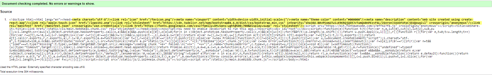
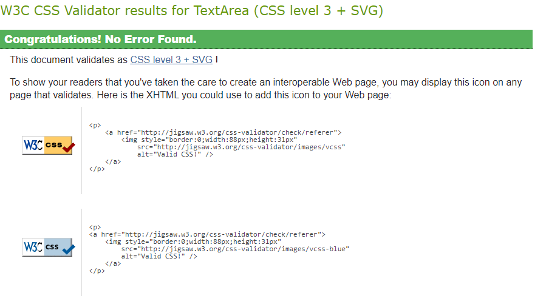
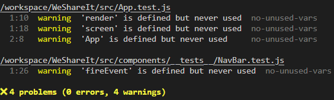

# WeShare-It - Frontend Testing

## Table of Contents

* [Testing](#testing)
    * [Code Validation](#code-validation)
        * [W3C HTML Validation Results](#w3c-html-validation-results)
        * [W3C CSS Validation Results](#w3c-css-validation-results)
        * [ESLint Validation Results](#eslint-validation-results)
    * [Automatic Testing](#automatic-testing)
        * [NavBar.js](#navbarjs)
        * [Avatar.js](#avatarjs)
    * [Manual Testing](#manual-testing)
        * [Authentication - User Logged Out](#authentication-user-logged-out)
        * [Navigation - User Logged Out](#navigation-user-logged-out)
        * [Homepage - User Logged Out](#homepage-user-logged-out)
        * [Pin Detail Page - User Logged Out](#pin-detail-page-user-logged-out)
        * [Profile Page - User Logged Out](#profile-page-user-logged-out)
        * [Navigation - User Logged In](#navigation-user-logged-in)
        * [Homepage - User Logged In](#homepage-user-logged-in)
        * [Create Pin Page - User Logged In](#create-pin-page-user-logged-in)
        * [Feed - User Logged In](#feed-user-logged-in)
        * [Love - User Logged In](#love-user-logged-in)
        * [Pin Detail Page - User Logged In](#pin-detail-page-user-logged-in)
        * [Edit Pin Page - User Logged In](#edit-pin-page-user-logged-in)
        * [Profile Page - User Logged In](#profile-page-user-logged-in)
        * [Edit Profile Page - User Logged In](#edit-profile-page-user-logged-in)

## Code Validation 

### W3C HTML Validation Results

No errors were found when the deployed WeShare-It URL was passed through W3C HTML validation.

### W3C CSS Validation Results

No errors or warnings were found when the deployed WeShare-It URL was passed through the W3C CSS Validation checker.

### ESLint Validation Results

No errors were found; warnings were cleared as they are unnecessary.

## Automatic Testing

The following Jest automatic tests have been written to check that the main frontend components render correctly: 

### NavBar.js
|  | | |
|:-------:|:--------|:--------|
| Renders Navbar Home link | ✔ |
| Renders link to the feed page for a logged-in user | ✔ |
| Renders link to the loved page for a logged-in user | ✔ |

### Avatar.js
| Avatar renders | ✔ |

## Manual Testing

I carried out the following additional manual tests to check all the user story scenarios:

| Status | **Authentication - User Logged Out**
|:-------:|:--------|
| &check; | Typing 'https://weshare-it-2feb6d10cc1b.herokuapp.com/feed' url into the browser, the user can not access the feed page. User is redirected Home
| &check; | Typing 'https://weshare-it-2feb6d10cc1b.herokuapp.com/loved' url into the browser, the user can not access the loved page. User is redirected Home
| &check; | Typing 'https://weshare-it-2feb6d10cc1b.herokuapp.com/create-pin' url into the browser, the user is redirected to Login
| &check; | Typing 'https://weshare-it-2feb6d10cc1b.herokuapp.com/profiles/{id}/edit' url into the browser, the user is redirected back to Home
| &check; | Desktop and tablet users can see an image next to the Login form
| &check; | Mobile users can't see an image next to the Login form

| Status | **Navigation - User Logged Out**
|:-------:|:--------|
| &check; | Clicking the navbar brand logo loads the home page
| &check; | Clicking the Home icon on the nav bar re-loads the home page
| &check; | Clicking the Login icon on the nav bar loads the login page
| &check; | Clicking the Sign Up button on the Login container show sign in modal
| &check; | The user can not see the Logout icon in the navigation bar
| &check; | Users can not see the Feed icon in the navigation bar
| &check; | Users can not see the Love icon in the navigation bar
| &check; | Users can not see the 'Create pin' in the navigation bar
| &check; | Mobile users can see the navigation bar options in a burger menu dropdown
| &check; | Clicking a link from the navigation bar links automatically closes the burger menu
| &check; | User can not login with false credentials - warning message displayed
| &check; | User can not login without filling out all the input fields - warning message displayed
| &check; | User can not sign-up without filling out all the input fields - warning message displayed
| &check; | User can not sign-up if the two password fields don't match - warning message displayed
| &check; | User can not sign up if the username chosen already exists in the database - warning message displayed

| Status | **Homepage - User Logged Out**
|:-------:|:--------|
| &check; | Users can view the most followed Profiles component
| &check; | Users can not view the follow button inside most followed profiles component
| &check; | Clicking on a most followed profile avatar, users are redirected to the selected profile page
| &check; | Desktop users can view the most followed profiles component on the right
| &check; | Mobile and tablet users can view the most followed profiles component under the navbar
| &check; | Users can view all posted pins - title, description, created date, image
| &check; | Users can view the love icon and count
| &check; | Users can view the comments icon and count
| &check; | Clicking on an pinned image, users are redirected to the selected pin detail page
| &check; | Clicking on an pinned comments icon, users are redirected to the selected pin detail page
| &check; | Clicking on an pin owner avatar, users are redirected to the selected profile page
| &check; | Users can search for a particular pin by typing in the pin title, the username of the pin owner, the pin category, or the pin description

| Status | **Pin Detail Page - User Logged Out**
|:-------:|:--------|
| &check; | Users can view the most followed profiles component
| &check; | Clicking on a most followed profile avatar, users are redirected to the selected profile page
| &check; | Desktop users can view the most followed profiles component on the right
| &check; | Mobile and tablet users can view the most followed profiles component under the navbar
| &check; | Users can view details of a single pin
| &check; | Clicking on an pin owner avatar, users are redirected to the selected profile page
| &check; | Clicking on the love icon, users are advised to login to love the pin
| &check; | Users can view any published comments posted about this pin
| &check; | Users can not view the create comment form

| Status | **Profile Page - User Logged Out**
|:-------:|:--------|
| &check; | Users can view the most followed Profiles component
| &check; | Clicking on a most popular profile avatar, users are redirected to the selected profile page
| &check; | Desktop users can view the most followed profiles component on the right
| &check; | Mobile and tablet users can view the most followed profiles component under the navbar
| &check; | Users can view the number of Pins the profile owner has posted
| &check; | Users can view the number of followers the selected profile has
| &check; | Users can view the number of other profiles the selected profile is following
| &check; | Clicking on the pinned image, users are redirected to the selected pin detail page
| &check; | Clicking on an pin comments icon, users are redirected to the selected pin detail page
| &check; | Clicking on the love icon, users are advised to login to love the pin

| Status | **Navigation - User Logged In**
|:-------:|:--------|
| &check; | Clicking the navbar brand logo loads the home page
| &check; | Clicking the Home button on the nav bar re-loads the home page
| &check; | User profile avatar is visible in the navigation bar
| &check; | Log-out icon is visible in the users navigation bar
| &check; | Feed icon menu is visible in the users navigation bar
| &check; | Love icon menu is visible in the users navigation bar
| &check; | Create pin icon is visible in the users navigation bar
| &check; | Burger menu icon will be visible for mobile user with the navigation menu inside
| &check; | Clicking a link from the navigation bar links automatically closes the burger menu

| Status | **Homepage - User Logged In**
|:-------:|:--------|
| &check; | Users can view the most followed profiles component
| &check; | Clicking on a most followed profiles avatar, users are redirected to the selected profile page
| &check; | Users can view the follow or un-follow button inside most followed profiles component
| &check; | Clicking on a most followed profiles follow button, users can become a follower of the selected profile
| &check; | Desktop users can view the most followed component on the right
| &check; | Mobile and tablet users can view the most followed profiles component under the navigation bar
| &check; | Clicking on a most followed profile avatar, users are redirected to the selected profile detail page
| &check; | Users can view all posted pins to the site - title, description, created date, and image
| &check; | Users can view the comments icon and count
| &check; | Users can view the love icon and count
| &check; | Clicking on an posted pin image, users are redirected to the selected pin detail page
| &check; | Clicking on the love icon, love count goes up and down on a toggle
| &check; | If the logged in user is the pin owner, user can not click the love button - tooltip warning given
| &check; | Clicking on comment icon, users are redirected to the selected pin detail page
| &check; | Clicking on an pin owner avatar, users are redirected to the selected profile page
| &check; | Users can search for a particular pin by typing in the pin title, the username of the pin owner, the pin category, or the pin description

| Status | **Create Pin Page - User Logged In**
|:-------:|:--------|
| &check; | Users can view the empty form to create a new pin
| &check; | Users can upload an image into the form
| &check; | Users can change an uploaded image
| &check; | Users can't create the form without an image - warning message displayed
| &check; | Users can't create the form without filling out the title field - warning message displayed

| Status | **Feed - User Logged In**
|:-------:|:--------|
| &check; | Users can view the most followed profiles component
| &check; | Clicking on a most followed profile avatar, users are redirected to the selected profile page
| &check; | Users can view the follow or un-follow button inside most followed profiles component
| &check; | Clicking on a most followed profile follow button, users can become a follower of the selected profile
| &check; | Desktop users can view the most followed profiles component on the right
| &check; | Mobile and tablet users can view the most followed profiles component under the navigation bar
| &check; | Users can view all posted pins by profiles they follow - title, description, created date, and image
| &check; | Users can view the love icon and count
| &check; | Users can view the comments icon and count
| &check; | Users see a "no results found message" if they don't follow any profiles, or the profiles they follow haven't posted any pins
| &check; | Clicking on an pin image, users are redirected to the selected pin detail page
| &check; | Clicking on the love icon, love count goes up and down on a toggle
| &check; | If the logged in user is the pin owner, user can not click the love button - tooltip warning given
| &check; | Clicking on an pin comments icon, users are redirected to the selected pin detail page
| &check; | Clicking on an pin owner avatar, users are redirected to the selected profile page
| &check; | Users can search for a particular pin by typing in the pin title, the username of the pin owner, the pin category, or the pin description

| Status | **Love - User Logged In**
|:-------:|:--------|
| &check; | Users can view the most followed profiles component
| &check; | Clicking on a most followed profiles avatar, users are redirected to the selected profile page
| &check; | Users can view the follow or un-follow button inside most followed Profile
| &check; | Clicking on a most followed profile follow button, users can become a follower of the selected profile
| &check; | Desktop users can view the most followed profiles component on the right
| &check; | Mobile and tablet users can view the most followed profiles component under the navigation bar
| &check; | Clicking on a most followed profiles avatar, users are redirected to the selected profile detail page
| &check; | Users can view all posted pins by profiles loved - title, description, created date, and image
| &check; | Users can view the love icon and count
| &check; | Users can view the comments icon and count
| &check; | Users see a "no results found message" if they don't loved any pins,
| &check; | Clicking on an pin image, users are redirected to the selected pin detail page
| &check; | Clicking on the love icon, will un-love the pin and pin will be remove to the love page
| &check; | Clicking on an pin comments icon, users are redirected to the selected pin detail page
| &check; | Clicking on an pin owner avatar, users are redirected to the selected profile page
| &check; | Users can search for a particular pin by typing in the pin title, the username of the pin owner, the pin category, or the pin description

| Status | **Pin Detail Page - User Logged In**
|:-------:|:--------|
| &check; | Users can view the most followed profiles component
| &check; | Clicking on a most followed  Profiles avatar, users are redirected to the selected profile page
| &check; | Desktop users can view the most followed profiles component on the right
| &check; | Mobile and tablet users can view the most followed profiles component under the navbar
| &check; | Clicking on a most followed profiles avatar, users are redirected to the selected profile detail page
| &check; | Users can view details of a single pin - title, description, created date, and image
 &check; | Users can view the love icon and count
| &check; | Users can view the comments icon and count
| &check; | Clicking on an pin owner avatar, users are redirected to the selected profile page
| &check; | If the logged in user is the pin owner, user can not click the love icon - tooltip warning given
| &check; | Clicking on the love icon, going count goes up and down on a toggle
| &check; | Users can view any published comments posted about this pin
| &check; | Users can view the create comment form
| &check; | Users can type into the comment form and post a comment to the pin
| &check; | On submitting a comment, the comment count increases by 1
| &check; | If the logged in user is the owner of a published comment, they can see the three dots edit/delete menu next to it
| &check; | User can edit their own comments via the three dots edit/delete menu
| &check; | User can delete their own comments via the three dots edit/delete menu
| &check; | On deleting a comment, the comment count decreases by 1
 &cross; | On clicking delete comment, user should presented with a modal popup to confirm the deletion request
| &check; | If the logged in user is the owner of the pin, they can see the three dots edit/delete menu to the right side
| &check; | User can edit their own pin via the three dots edit/delete menu
| &check; | On clicking edit pin, user is redirected to the edit pin page
| &check; | User can delete their own pin via the three dots edit/delete menu
| &cross; | On clicking delete pin, user is should presented with a modal popup to confirm the deletion request

| Status | **Edit Pin Page - User Logged In**
|:-------:|:--------|
| &check; | Users can view the edit pin form pre-populated with the current pin details
| &check; | Users can upload an image into the form
| &check; | Users can change an uploaded image
| &check; | Users can't save the form without an image - warning message displayed
| &check; | Users can't save the form without filling out the title field - warning message displayed

| Status | **Profile Page - User Logged In**
|:-------:|:--------|
| &check; | Users can view the most followed profiles component
| &check; | Clicking on a most followed profile avatar, users are redirected to the selected profile page
| &check; | Users can view the number of pins the profile owner has posted
| &check; | Users can view the number of followers the selected profile has
| &check; | Users can view the number of other profiles the selected profile is following
| &check; | Users can view the pins which were posted by the selected profile
| &check; | Clicking on the pin image, users are redirected to the selected pin detail page
| &check; | Clicking on the follow or un-follow button, followers or following count goes up and down on a toggle
| &check; | If the logged in user is the pin owner, user can not click the love icon - tooltip warning given
| &check; | Clicking on an pin comments icon, users are redirected to the selected pin detail page
| &check; | If the user is viewing their own profile page, they can see the three dots edit profile menu next to the profile stats
| &check; | Users can edit their own profile page, change username and change password via the three dots
| &check; | On clicking edit profile, user is redirected to the edit profile page
| &check; | User can change their own username via the three dots change username button
| &check; | User can change their own password via the three dots change password button

| Status | **Edit Profile Page - User Logged In**
|:-------:|:--------|
| &check; | Users can view the profile form pre-populated with the current profile details
| &check; | Users can upload an avatar image into the form
| &check; | Users can change the uploaded image
| &check; | Users can change Bio input